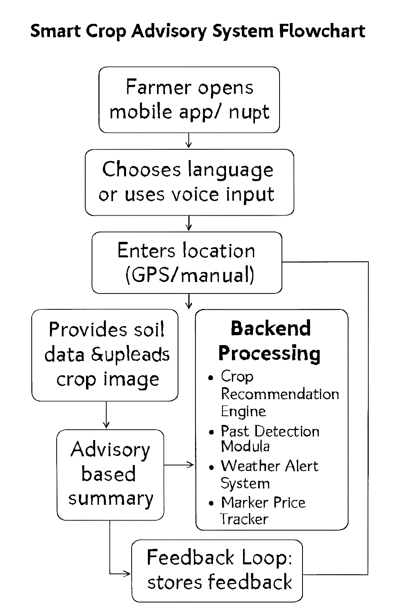

# Smart India Hackathon Workshop
# Date: 29.09.2025
## Register Number: 25012265
## Name: Shreeshanth R
## Problem Title
SIH 25010: Smart Crop Advisory System for Small and Marginal Farmers
## Problem Description
A majority of small and marginal farmers in India rely on traditional knowledge, local shopkeepers, or guesswork for crop selection, pest control, and fertilizer use. They lack access to personalized, real-time advisory services that account for soil type, weather conditions, and crop history. This often leads to poor yield, excessive input costs, and environmental degradation due to overuse of chemicals. Language barriers, low digital literacy, and absence of localized tools further limit their access to modern agri-tech resources.

Impact / Why this problem needs to be solved

Helping small farmers make informed decisions can significantly increase productivity, reduce costs, and improve livelihoods. It also contributes to sustainable farming practices, food security, and environmental conservation. A smart advisory solution can empower farmers with scientific insights in their native language and reduce dependency on unreliable third-party advice.

Expected Outcomes

• A multilingual, AI-based mobile app or chatbot that provides real-time, location-specific crop advisory.
• Soil health recommendations and fertilizer guidance.
• Weather-based alerts and predictive insights.
• Pest/disease detection via image uploads.
• Market price tracking.
• Voice support for low-literate users.
• Feedback and usage data collection for continuous improvement.

Relevant Stakeholders / Beneficiaries

• Small and marginal farmers
• Agricultural extension officers
• Government agriculture departments
• NGOs and cooperatives
• Agri-tech startups

Supporting Data

• 86% of Indian farmers are small or marginal (NABARD Report, 2022).
• Studies show ICT-based advisories can increase crop yield by 20–30%.

## Problem Creater's Organization
Government of Punjab

## Theme
Agriculture, FoodTech & Rural Development

## Proposed Solution
<ul><li>
The Smart Crop Advisory System is a multilingual, AI-powered mobile app and chatbot designed to empower small and marginal farmers with personalized, real-time agricultural guidance. By integrating soil data, weather forecasts, and crop history, it offers tailored recommendations for crop selection, fertilizer use, and pest management. Farmers can upload images for disease detection, receive weather-based alerts, and access market price trends—all in their native language with voice support for low-literate users. This solution reduces dependency on unreliable advice, lowers input costs, boosts yield, and promotes sustainable farming practices, ultimately improving livelihoods and contributing to food security.
</li></ul>

## Technical Approach
<ul><li>The Smart Crop Advisory System will be developed using a combination of AI, machine learning, and mobile technologies to deliver personalized agricultural guidance. The backend will be built with Python and Django, integrating machine learning models (using TensorFlow or PyTorch) for crop recommendation and pest detection. Weather data will be fetched via APIs from reliable sources like IMD, while soil health inputs can be manually entered or sourced from local databases. The mobile app will be developed using Android Studio with Firebase for real-time data sync and user management. Natural Language Processing (NLP) will enable multilingual support, and voice interaction will be powered by speech-to-text and text-to-speech modules. A feedback loop will be embedded to refine recommendations based on user outcomes, ensuring continuous improvement and scalability.</li></ul>

## Feasibility and Viability
<ul><li>
The Smart Crop Advisory System is highly feasible due to the widespread availability of mobile networks and increasing smartphone penetration among rural farmers in India. Leveraging open-source technologies and existing weather and soil data APIs ensures cost-effective development and scalability. Potential challenges include low digital literacy, language diversity, and inconsistent data quality, but these can be mitigated through voice-based interfaces, regional language support, and partnerships with local agricultural bodies. The solution is viable both technically and economically, with strong potential for government and NGO collaboration, making it sustainable and impactful in the long term.
</li></ul>

## Impact and Benefits
<ul><li>
The Smart Crop Advisory System has the potential to transform the lives of small and marginal farmers by enabling data-driven decisions that enhance productivity and reduce input costs. Socially, it empowers farmers with scientific knowledge in their native language, reducing reliance on informal and often inaccurate advice. Economically, it helps optimize resource use, increase crop yields, and improve market access through real-time price tracking. Environmentally, the system promotes sustainable farming by minimizing chemical overuse and encouraging soil health management. Overall, it contributes to rural development, food security, and a more resilient agricultural ecosystem.
</li></ul>

## Research and References
<ul><li>
1. NABARD Report 2022 – Highlights that 86% of Indian farmers are small or marginal, underscoring the need for targeted digital solutions.
https://www.nabard.org
2. FAO ICT in Agriculture Study – Demonstrates how ICT-based advisories can improve crop yield by 20–30%.
http://www.fao.org/ict-agriculture
3. Indian Meteorological Department (IMD) – Provides weather APIs for real-time agricultural alerts.
https://mausam.imd.gov.in
4. IEEE Xplore & SpringerLink – Research papers on AI, machine learning, and computer vision applications in agriculture.
https://ieeexplore.ieee.org
https://link.springer.com
5. AgriTech Startups in India – Case studies from platforms like KisanHub, CropIn, and DeHaat for reference on scalable advisory models.
</li></ul>